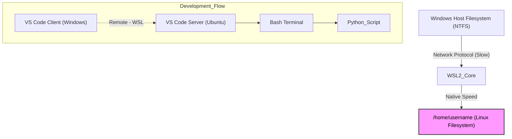

# ☁️ `linux_in_windows`

## 🏗️ Topology (구조도)
Windows 위에서 독립적으로 돌아가는 리눅스(Ubuntu)와 개발 도구들의 연결 구조입니다.



## 🛠️ Setup Procedure (단계별 구축 가이드)

### Step 1. WSL2 및 Ubuntu 설치
Windows PowerShell을 관리자 권한으로 실행하여 WSL2와 기본 Ubuntu 배포판을 설치합니다.
```powershell
wsl --install -d Ubuntu
```

### Step 2. Ubuntu 초기 설정
Windows 시작 메뉴에서 **Ubuntu** 앱을 실행하여 리눅스 환경에 접속합니다. 최초 실행 시 사용할 UNIX 계정 정보를 설정합니다.

### Step 3. Git 사용자 정보 설정 (Global)
Ubuntu 환경은 새로운 컴퓨터이므로, GitHub 활동 기록(잔디)을 위해 사용자 정보를 등록해야 합니다.
```bash
# GitHub 아이디 설정 (ju1115)
git config --global user.name "ju1115"

# GitHub 가입 이메일 설정 (필수: 잔디 연동용)
git config --global user.email "joo4123@naver.com"

# 설정 확인
git config --list
```

### Step 4. Node.js (LTS/최신) 환경 구성
기본 저장소의 구버전 Node.js 대신, 최신 LTS 버전을 설치하여 호환성 문제를 방지합니다.
```bash
curl -fsSL https://deb.nodesource.com/setup_24.x | sudo -E bash -
sudo apt install -y nodejs
```

### Step 5. Gemini CLI 도구 설치
터미널 환경에서 AI를 활용하기 위해 검증된 커뮤니티 버전의 CLI를 설치합니다.
```bash
sudo npm install -g @google/gemini-cli
```

### Step 6. Repository Clone (작업 공간 설정)
반드시 **WSL 리눅스 홈 디렉토리(`~`)** 내부에서 작업을 진행해야 합니다.
```bash
cd ~
git clone [레포지토리_주소]
```

### Step 7. VS Code 실행 (Remote - WSL)
Windows VS Code에 **WSL** 확장 플러그인이 설치된 상태에서, Ubuntu 터미널을 통해 실행합니다.
```bash
cd [프로젝트_폴더명]
code .
```

---

## 💡 Important: OS Differences (운영체제 차이점)

### 파일명 대소문자 구분 (Case Sensitivity)
스크립트 실행 시 파일 생성 동작이 Windows와 다를 수 있습니다.

| 구분 | Windows (NTFS) | **WSL (Linux)** |
| :--- | :--- | :--- |
| **특징** | **Case-Insensitive** (구분 없음) | **Case-Sensitive** (엄격하게 구분) |
| **동작 예시** | `readme.md`와 `README.md`를 **같은 파일**로 인식함. | `readme.md`와 `README.md`는 **완전히 다른 파일**로 인식함. |
| **주의사항** | 파일 덮어쓰기 시 기존 파일이 유지될 수 있음. | 같은 이름의 파일이 대소문자만 다르게 **동시에 존재**할 수 있음. |

> **Action:** 리눅스 환경에서는 `README.md` (대문자)와 같이 표준 컨벤션을 정확히 지키는 것이 중요합니다. 불필요한 소문자 파일은 삭제(`rm readme.md`)하여 혼동을 방지하세요.

---

## ⚙️ Additional Configuration (추가 설정)

### Python 실행 환경 매핑 (`python` -> `python3`)
```bash
sudo apt update
sudo apt install python-is-python3
```

## ⚠️ Check Point
1.  **Git Identity:** `git config`에 등록한 이메일이 GitHub 계정과 일치하는가?
2.  **File Naming:** `README.md` vs `readme.md` 등 대소문자 문제로 인해 중복 생성된 파일은 없는가?
3.  **Extension:** VS Code 좌측 하단에 `WSL: Ubuntu`가 표시되고 있는가?
