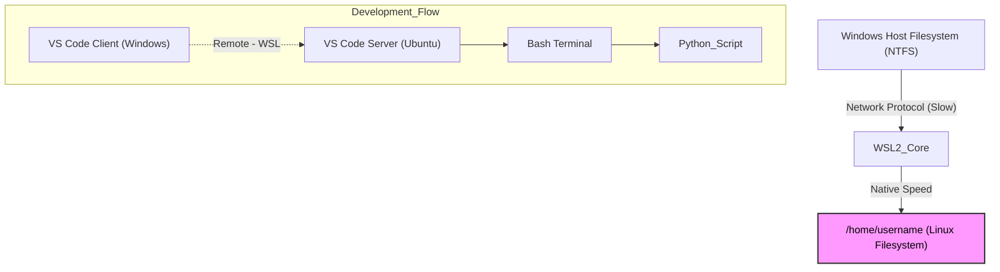

# ☁️ `linux_in_windows`

## 🏗️ Topology (구조도)
Windows 위에서 독립적으로 돌아가는 리눅스(Ubuntu)와 개발 도구들의 연결 구조입니다.



## 🛠️ Setup Procedure (단계별 구축 가이드)

### Step 1. WSL2 및 Ubuntu 설치
Windows PowerShell을 관리자 권한으로 실행하여 WSL2와 기본 Ubuntu 배포판을 설치합니다.

```powershell
wsl --install -d Ubuntu
```
> **Note:** 설치 완료 후 시스템 재부팅이 필요할 수 있습니다.

### Step 2. Ubuntu 초기 설정
Windows 시작 메뉴에서 **Ubuntu** 앱을 실행하여 리눅스 환경에 접속합니다. 최초 실행 시 사용할 UNIX 계정 정보를 설정합니다.
* **Username:** (영문 소문자 권장)
* **Password:** (입력 시 화면에 보이지 않음)

### Step 3. Node.js (LTS/최신) 환경 구성
기본 저장소(`apt`)의 Node.js는 버전이 낮아 최신 패키지 호환성 문제(RegExp Flag 등)가 발생합니다. NodeSource를 통해 최신 LTS 버전(v24.x)을 설치합니다.

```bash
# 구버전 충돌 방지 및 최신 버전 저장소 연결
sudo apt remove nodejs npm -y && sudo apt autoremove -y
curl -fsSL https://deb.nodesource.com/setup_24.x | sudo -E bash -

# 설치 확인
sudo apt install -y nodejs
node -v
```

### Step 4. Gemini CLI 도구 설치
터미널 환경에서 AI를 활용하기 위해 검증된 커뮤니티 버전의 CLI를 설치합니다.

```bash
sudo npm install -g gemini-chat-cli
```

### Step 5. Repository Clone (작업 공간 설정)
Windows 파일 시스템(`/mnt/c/`)이 아닌, **WSL 리눅스 홈 디렉토리(`~`)**에 프로젝트를 위치시켜야 **Hot Reload** 기능과 **I/O 성능**이 보장됩니다.

```bash
# 반드시 홈 디렉토리로 이동 후 진행
cd ~
git clone [레포지토리_주소]
```

### Step 6. VS Code 확장 플러그인 (Extension)
Windows에 설치된 VS Code를 실행하고, 마켓플레이스에서 **Remote - WSL** 확장을 설치합니다.
* **확장명:** `WSL` (Publisher: Microsoft)

### Step 7. 프로젝트 실행 (Remote Connection)
Ubuntu 터미널에서 프로젝트 폴더로 이동한 뒤 VS Code를 실행하여 WSL 서버에 접속합니다.

```bash
cd [프로젝트_폴더명]
code .
```
> **Tip:** VS Code 좌측 하단에 `WSL: Ubuntu` 표시가 떠야 정상적으로 연결된 상태입니다.

---

## ⚙️ Additional Configuration (추가 설정)

### Python 실행 환경 매핑 (`python` -> `python3`)
Ubuntu의 기본 명령어인 `python3` 대신 `python` 명령어로 스크립트를 실행하기 위해 패키지를 설치합니다.

```bash
sudo apt update
sudo apt install python-is-python3
```

## 🚀 Deployment Command
모든 환경 설정이 완료된 후, 자동화 스크립트를 실행합니다.

```bash
# API Key 설정 (필요 시)
export GEMINI_API_KEY="AIzaSy..."

# 배포 스크립트 실행
python create.py "linux_in_windows" -c wsl
```

## ⚠️ Check Point
1. **File System:** 소스 코드가 `/home/username` 경로 하위에 존재하는가? (Windows 마운트 경로 `mnt` 제외)
2. **Extensions:** VS Code의 필수 확장(ESLint, Python 등)이 **[Install in WSL]** 버튼을 통해 리눅스 환경에 설치되었는가?
3. **Git Identity:** `git config --global` 설정을 통해 유저 이름과 이메일을 등록했는가?