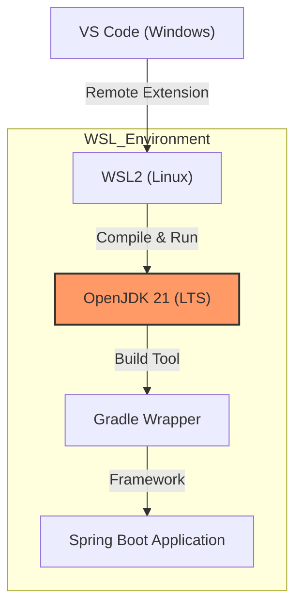

# ☁️ `wsl_개발환경_세팅` (Java & Spring Boot)

## 🏗️ Topology (구조도)
VS Code(Windows)에서 WSL(Ubuntu) 내부의 JDK와 Spring Boot 환경을 제어하는 구조입니다.



## ⚙️ Configuration (설정)

### 1. JDK 설치 (OpenJDK 21)
현업 표준인 LTS 버전(21)을 우분투 패키지 매니저로 설치합니다.
```bash
sudo apt update
sudo apt install openjdk-21-jdk -y

# 설치 확인
java -version
```

### 2. 환경변수 설정 (`JAVA_HOME`)
Gradle 등 빌드 도구가 자바 경로를 찾을 수 있도록 `.bashrc`에 환경변수를 등록합니다.
> **File:** `~/.bashrc` (하단에 추가)

```bash
# 1. 환경변수 등록 명령어 실행
echo "export JAVA_HOME=/usr/lib/jvm/java-21-openjdk-amd64" >> ~/.bashrc
echo "export PATH=\$JAVA_HOME/bin:\$PATH" >> ~/.bashrc

# 2. 설정 즉시 적용
source ~/.bashrc
```

### 3. VS Code 확장팩 (Extensions)
**주의:** 반드시 **[Install in WSL: Ubuntu]** 버튼을 눌러 리눅스 환경에 설치해야 합니다.

| Extension Name | 필수 여부 | 역할 |
| :--- | :--- | :--- |
| **Markdown Preview Mermaid Support** | 선택 | mermaid viewr |
| **Extension Pack for Java** | ⭐ 필수 | Java 인텔리센스, 디버깅, Maven/Gradle 지원 |
| **Spring Boot Extension Pack** | ⭐ 필수 | 프로젝트 생성, 설정 파일(.yaml) 자동완성 |
| **Lombok Annotations Support** | ⭐ 필수 | Getter/Setter 등 보일러플레이트 코드 제거 |

## 🚀 Deployment Command
Spring Boot 프로젝트 생성 후, 터미널에서 애플리케이션을 실행하는 명령어입니다.

```bash
# 프로젝트 루트 경로에서 실행 (Gradle 기준)
./gradlew bootRun
```

## ⚠️ Check Point
- [ ] **Java Version:** `java -version` 실행 시 `OpenJDK 21`이 출력되는가?
- [ ] **Environment Variable:** `echo $JAVA_HOME` 입력 시 경로(`/usr/lib/jvm/...`)가 출력되는가?
- [ ] **VS Code:** 확장팩 탭에서 Spring Boot 관련 플러그인이 `WSL: Ubuntu` 섹션에 활성화되어 있는가?
- [ ] **Build:** `./gradlew build` 명령어가 에러 없이 성공하는가?